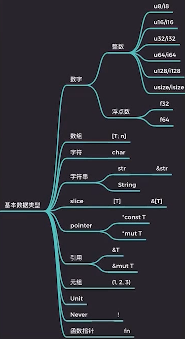

# 类型

- 基本数据类型
- 自定义复合类型
- 容器类型
- 泛型
- 特定类型

## 基本数据类型



### 数字

- 整数
- 浮点数

usize 和 isize 是无符号有符号指针大小的类型，指针大小一般和计算机字长大小相等， 32 位处理器指针大小是 4 子节，64 位处理器指针大小则是 8 子节。

### 布尔

- true
- false

### 数组

等**常量泛型**功能稳定后，数组就可以晋升为一等公民，统一为`[T;N]`

### 字符

Rust 字符是一个 Unicode 标量类型，就是只实际存在的 Unicode 字符，占 4 个字节。

### 字符串

Rust 字符串根据使用场合进行分类：

- 字面量
- 动态可增长字符串
- 从一段字符串中截取的片段
- 字符串编码
- FFi 中需要转换字符串到 C 或 OS 本地字符串
- 遵循特定格式的文件路径

#### 字符串与切片

字符串为 UTF-8 编码的 u8 序列

1. &str -> &\[u8\] 字符串可以转为合法 UTF-8 的 u8 序列，反之则不一定。
2. String -> Vec\<u8\> 动态字符串可以转为合法 UTF-8 的动态数组，反之则不一定。

### 引用

- &T 不可变引用，共享引用。
- &mut T 可变引用，独占引用。

#### 指针

- 原始指针，`*mut T`和`*const T`。**一般用于 unsafe rust 中**。
- NonNull 指针，它是 Rust 语言建议的`*mut T`指针的替代指针。NonNull 指针是非空指针，并且是遵循生命周期类型协变规则。
- 函数指针，函数指针是指向代码的指针，而非数据。可以使用它直接调用函数。

#### 引用与指针的主要区别

- 引用不可能为空
- 拥有生命周期
- 受借用检查器保护不会发生悬垂指针等问题

### 元组

唯一的异构序列

- 不同长度的元组是不同类型
- 单元类型的唯一实例等价于空元组
- 当元组只有一个元素的时候，要在元素末尾加逗号分隔，这是为了方便和括号操作符区分开来

### Nerver 类型

代表的是不可能返回值的计算类型

- 类型理论中，叫做底类型，底类型不包含任何值，但它可以合一到任何其他类型。
- Nerver 类型用`!`表示
- 目前还未稳定，但是在 Rust 内部已经在用了

## 自定义复合类型

### 结构体 Struct

- 具名结构体，包含了字段，有名字
- 元组结构体，包含了字段，但没有名字
- 单元结构体，可以当做一个占位符，也不会占用实际内存空间

```rust
struct Point {
    x: f32,
    y: f32,
}

// 元组结构体
struct Pair(i32, f32);

// 单元结构体
struct Unit;

fn main() {
    let point = Point { x: 1.0, y: 2.0 };
    let pair = Pair(1, 2.0);
    assert_eq!(pair.0, 1);
    let unit1 = Unit;
    let unit2 = Unit;
}
```

#### NewType 模式

当元组结构体只包含一个成员时

```rust
struct Score(u32);

impl Score {
    fn pass(&self) -> bool {
        self.0 >= 60
    }
}

fn main() {
    let s = Score(59);
    assert_eq!(s.pass(), false);
}
```

#### 结构体内存布局

编译器重排字段，优化内存占用，会调整字段顺序为最大占用子节数的倍数

```rust
struct A {
    a: u16,
    b: u32,
    c: u8,
}

fn main() {
    println!("{:?}", std::mem::size_of::<A>()); // 8
    let v = A { a: 1, b: 2, c: 3 };
}
```

如果不想编译器优化内存布局，则可以使用属性`#[repr(C)]`

### 枚举体 和 联合体

以枚举类型成员最大的对齐值为准，不需要为每个枚举值都对齐。联合体类似。

枚举体比联合体多一个 tag，如果只有 tag，则占一个字节。

```rust
enum A {
    One,
    Two,
}

enum E {
    N,
    H(u32),
    M(Box<u32>),
}

union U {
    u: u32,
    v: u64,
}

fn main() {
    println!("A: {:?}", std::mem::size_of::<A>()); // 1
    println!("Box<u32>: {:?}", std::mem::size_of::<Box<u32>>()); // 8
    println!("E: {:?}", std::mem::size_of::<E>()); // 16
    println!("U: {:?}", std::mem::size_of::<U>()); // 8
}
```

## 容器类型

### 可变容器

可共享可变容器，支持内部可变性

- UnsafeCell
- Cell
- RefCell

#### 内部可变性

1. 与继承式可变相对应
2. 由可变性核心原语 `UnsafeCell<T>` 提供支持
3. 基于 `UnsafeCell<T>` 提供了 `Cell<T>` 和 `RefCell<T>`

#### Cell<T>

```rust
use std::cell::Cell;

struct Foo {
    x: u32,
    y: Cell<u32>,
}

fn main() {
    let foo = Foo {x:1, y: Cell::new(3)};
    assert_eq!(1, foo.x);
    assert_eq!(3, foo.y.get());
    foo.y.set(5);
    assert_eq!(5, foo.y.get());

    let s = "Hello".to_string();
    let bar = Cell::new(s);
    let x = bar.into_inner();
    // bar; // error[E0382]: use of moved value: `bar`
}
```

#### RefCell<T>

T 适合没有实现 Copy trait 的类型。

```rust
use std::cell::RefCell;

fn main () {
  let x = RefCell::new(vec![1, 2, 3, 4]);
  println!("{:?}", x.borrow());
  x.borrow_mut().push(5);
  println!("{:?}", x.borrow());
}
```

运行时借用检查

```rust
use std::cell::RefCell;

fn main () {
    let x = RefCell::new(vec![1, 2, 3, 4]);
    let mut mut_v = x.borrow_mut();
    mut_v.push(5);
    let mut mut_v2 = x.borrow_mut(); // thread 'main' panicked at 'already borrowed: BorrowMutError'
}
```

### 集合容器

数据集合容器

- Vec
- HashMap

## 泛型

所谓泛型，就是参数化类型

```rust
fn foo<T>(x: T) -> T {
  x
}

fn main () {
  assert_eq!(foo(1), 1);
  assert_eq!(foo("hello"), "hello");
}
```

### 静态分发

泛型是一种抽象方式，在 Rust 中是零成本的，在编译期会单态化，在实际调用的位置生成具体类型相关的代码。

### turbofish 操作符

当类型推断失效，需要手工指定类型的时候使用

```rust
foo(1);
// 等价于
foo::<i32>(1);

foo("hello");
// 等价于
foo::<&'static str>("hello");
```

### 生命周期参数

TODO

## 特定类型

所谓特定类型，是指专门有特殊用途的类型

### PhantomData<T>，幻影类型

占位或者一般用于 Unsafe Rust 的安全抽象。

### Pin<T>，固定类型

为了支持异步开发儿特意引进，防止被引用的值发生移动的类型。
