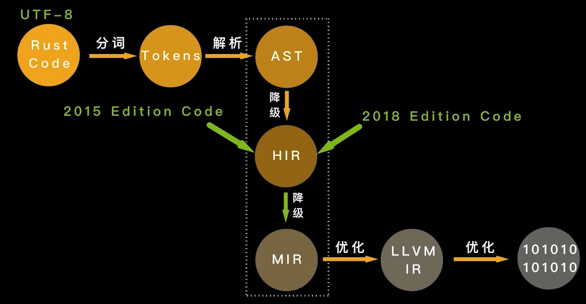

# Rust 编译过程



## Rust 编译期计算

Rust 1.26 版本开始支持编译期计算

1. 过程宏 + Build 脚本（build.rs）
2. **CTFE（compile time function evalutaion）**

## Rust 的 CTFE

- 常量函数（const fn）
- 常量泛型（const generic）

### 常量函数

```rust
/// 求最大公约数
const fn gcd(a: u32, b: u32) -> u32 {
    match (a, b) {
        (x, 0) | (0, x) => x,
        (x, y) if x % 2 == 0 && y % 2 == 0 => 2 * gcd(x / 2, y / 2),
        (x, y) | (y, x) if x % 2 == 0 => gcd(x / 2, y),
        (x, y) if x < y => gcd((y - x) / 2, x),
        (x, y) => gcd((x - y) / 2, y),
    }
}

const GCD: u32 = gcd(21, 7);

fn main () {
    println!("{}", GCD);
}
```

支持内部嵌入式定义与递归

```rust
const fn fib(n: u128) -> u128 {
    const fn helper(n: u128, a: u128, b: u128, i: u128) -> u128 {
        if i <= n {
            helper(n, b, a + b, i + 1)
        } else {
            b
        }
    }
    helper(n, 1, 1, 2)
}

const X: u128 = fib(10);

fn main () {
    println!("{}", X);
}
```

### 常量泛型

**目前常量泛型还未稳定**

#### 为什么需要常量泛型

Rust 中的静态数组一直以来都属于【二等公民】，不方便使用。通过常量泛型，可以是静态数组成为一等公民

```rust
let arr: [3; i32] = [1, 2, 3];
let arr: [5; i32] = [1, 2, 3 ,4 ,5];
```

两个数组是不同类型。

#### 常量泛型是什么

```rust
#![feature(min_const_generics)]
use core::mem::MaybeUninit;

pub struct ArrayVec<T, const N: usize> {
    items: [MaybeUninit<T>; N],
    length: usize,
}
```

## 常量上下文和常量表达式

```rust
fn main () {
  let an = (42,).0;
  const AN: i32 = an; // error[E0435]: attempt to use a non-constant value in a constant
  // fixed error:
  const AN: i32 = (42,).0;
}
```

常量上下文（const context）包含：

1. 常量值初始化位置
2. 静态数组的长度表达式，如[T;N]
3. 重复的长度表达式，类似于[0;10]
4. 静态变量、枚举判别式的初始化位置

常量上下文可接受的常量表达式：

1. const fn 函数
2. 元组结构体
3. 元组的值

## 常量安全

1. Rust 里的大部分表达式都可用作常量表达式。
2. 并不是所有常量表达式都可以用在常量上下文，比如磁盘中的某个文件长度。
3. 编译期求值必须得到一个确定性的结果。

## 常量安全子类型系统

1. 普通的 fn 关键字定义的函数，是 Safe Rust 主类型系统保证安全。
2. const fn 定义的函数，是 Safe Rust 主类型系统下有一个专门用于常量计算的子类型系统保证常量安全。

## 注意事项

### 常量传播

常量传播和编译期计算是不同的：

1. 常量传播是编译器的一种优化
2. 常量传播并不能改变程序的任何行为，并且对开发者是隐藏的
3. 编译期计算则是指编译时执行的代码，必须知道其结果，才能继续执行

```rust
const X: u32 = 3 + 4; // CTFE
let x: u32 = 4 + 3; // 不是 CTFE，但可能会被常量传播优化，因为它不在常量上下文
```

### while true 和 loop 的区别

```rust
fn main () {
  let mut a;
  while true {
    a = 1;
    break;
  }

  println!("{}", a); // error[E0381]: borrow of possibly-uninitialized variable: `a`
}
```

上述代码会编译错误，改为 loop 则会通过编译，因为 `while true` 需要进行编译计算。

1. 要考虑： `while(constexpr == true)` 的情况。
2. 使用 `#[allow(while_true)]`属性在某些情况下允许使用`while true`
