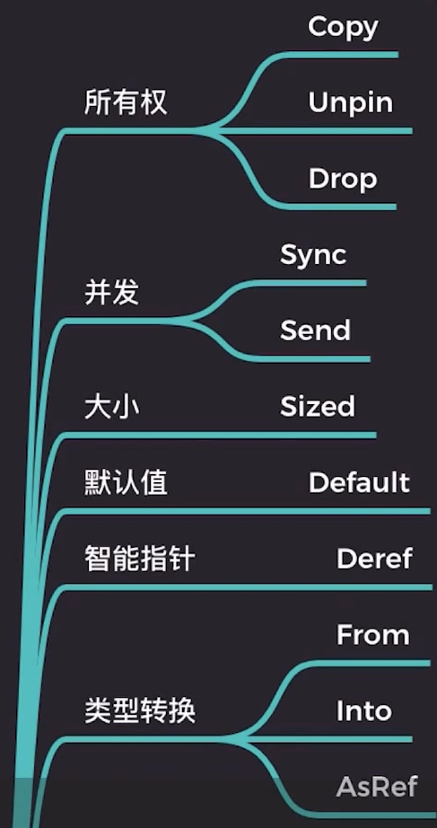

# 行为

字符串切片通过 parse 转换为 u32 类型

```rust
fn main () {
    fn main () {
        let four: u32 = "4".parse().unwrap();
        assert_eq!(4, four);
    }
}
```

字符串切片通过 parse 转换为 Point 类型

```rust
struct Point(i32, i32);

fn main () {
    let p = "(1, 2)".parse::<Point>();
    assert_eq!(p.unwrap(), Point(1, 2));
}
```

该如何实现 parse 方法？

```rust
impl u32 {
    fn from_str(s: &str) -> u32 {
        // do something
    }
}

impl Point {
    fn from_str(s: &str) -> Point {
        // do something
    }
}

impl str {
    pub fn parse<F>(&self) -> Result<F, F:Err> {
        F::from_str(self);
    }
}

"4".parse::<u32>();
// 等价于
u32::from_str("4");

"(1, 2)".parse::<Point>();
// 等价于
Point::from_str("(1, 2)");
```

虽然能够实现，但是存在一个问题：

如果其他人想要为 parse 方法实现转换为其他类型，则需要知道其 str 类型 parse 方法内部实现，知道其 from_str 方法名。

得出结论：因为无论是 u32 或者是 Point 类型，使用 from_str 方法，遵循相同的行为。

## trait

**Rust 为了解决相同的行为，增加开发体验，则引入了 trait 来统一行为接口。**

```rust
// 定义 FromStr trait
pub trait FromStr {
    type Err;
    fn from_str(s: &str) -> Result<Self, Self::Err>;
}

// 为 u32 实现 FromStr
impl FromStr for u32 {
    fn from_str(s: &str) -> Result<Self, Self::Err> {
        // do something
    }
}

// 为 Point 实现 FromStr
impl FromStr for Point {
    fn from_str(s: &str) -> Result<Self, Self::Err> {
        // do something
    }
}

impl str {
    // 使用 FromStr 对泛型 F 进行限定
    pub fn parse<F: FromStr>(&self) -> Result<F, <F as FromStr>::Err> {
        F::from_str(self);
    }
}
```

## trait 是一种特设多态

Ad-hoc 多态：一个接口，多个实现，也就是特设多态。

如下的“+”号 Add trait 实现：

```rust
pub trait Add<Rhs = Self> {
    type Output;
    fn add(self, rhs: Rhs) -> Self::Output;
}

// u32 加法
impl Add for u32 {
    type Output = u32;
    fn add(self, other: u32) -> u32 {
        self + other
    }
}

// 动态字符串 加法
impl Add for String {
    type Output = String;
    fn add(self, other: &str) -> String {
        self.push_str(other);
        self
    }
}

fn main () {
    let num = 1 + 1;
    let s = "1".to_string() + "1";
    assert_eq!(num, 2);
    assert_eq!(s, "11");
}
```

**孤儿规则： trait 或类型，必须有一个在本地定义**

## 函数重载

**想要调用 trait 上的方法，则需要使用完全无歧义限定语法**

```rust
struct A;

impl A {
    fn hello(&self) {
        println!("in A");
    }
}

trait Hello {
    fn hello(&self);
}

impl Hello for A {
    fn hello(&self) {
        println!("from Hello trait");
    }
}

fn main() {
    let a = A;
    a.hello(); // in A
    <A as Hello>::hello(&a); // from Hello trait [完全无歧义限定语法]
}

```

## trait 掌控类型行为逻辑

转移是默认行为，但因为 Copy trait 的存在，则这种行为的逻辑被更改了。

```rust
fn main () {
    let a = "Hello".to_string();
    let b = a;
    // a; // 这行报错：变量绑定 a 已经被 Move，无法再用
}
```

```rust
fn main () {
    let a = 42;
    let b = a;
    a; // 变量绑定 a 没有被 Move，可以再用
}
```

## 仿射类型（Affine Type）

类型系统中用于标识内存等资源，最多只能被使用一次。

## 内置 trait 分类



TODO： 详细梳理标准库文档中的内置 trait
