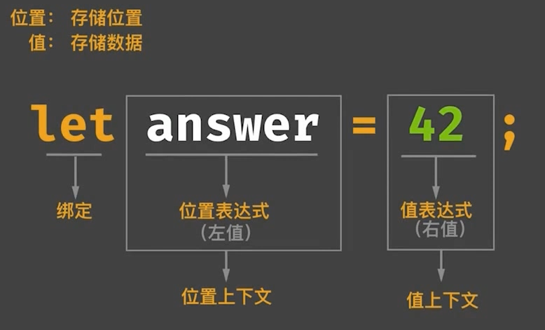
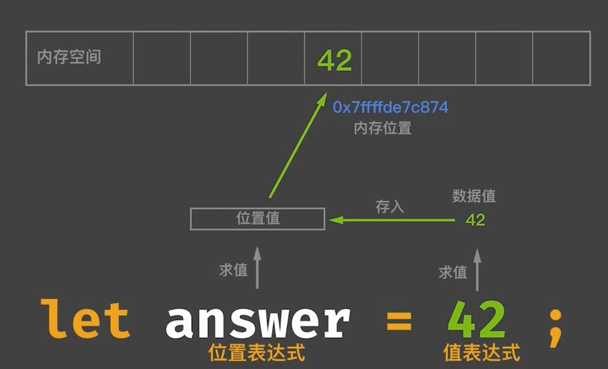
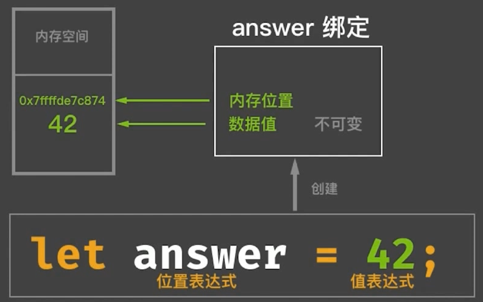
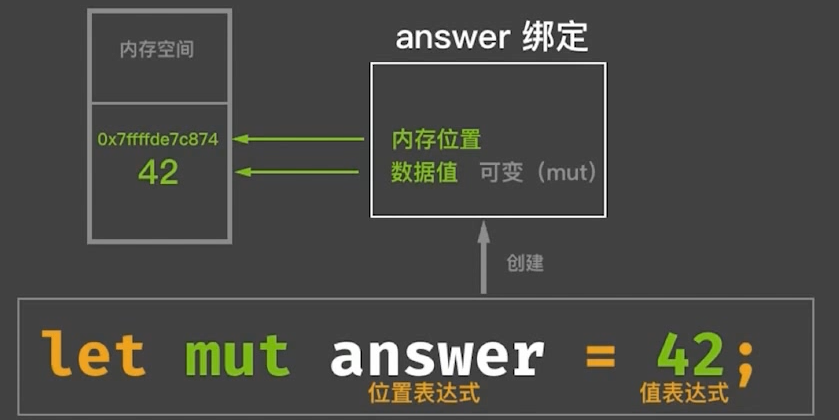
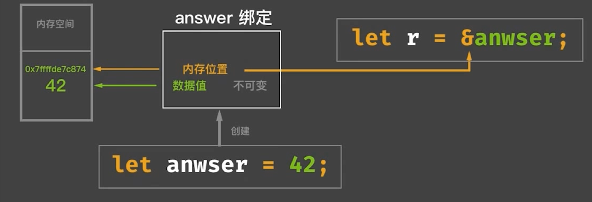
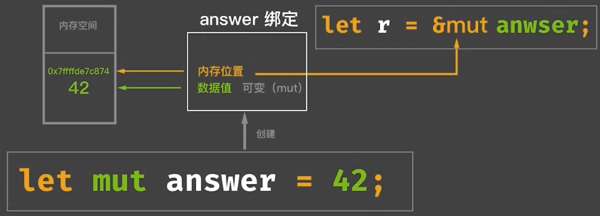

# 表达式

Rust 是一门面向**表达式**的语言。

## Rust 骨架

- 属性，类似于`#![...]`
- 分号，行分隔符
- 花括号，块分隔符

## 求值规则

1. 分号表达式返回值是永远为自身的单元类型 `()`
2. 分号表达式只有在块表达式最后一行才会进行求值，其他时候只作为连接符*存在*
3. 块表达式只对其最后一行表达式进行求值

## Rust 与其他语言的区别

Rust **是面向表达式的语言**，有别于其他编程语言。表达式都会返回值，值都有类型，从而引申出**一切皆类型**

除了声明语句外，其余基本都是**表达式**

- 分号表达式返回产生单元类型(Unit Type)
- 块表达式返回块中最后一个表达式的值

问题：为什么 if-else 条件循环只能返回相同的类型？

因为 if-else 是表达式，表达式返回值必须为相同类型

## 表达式分类



1. 对位置表达式求值，可以得到代表内存位置的值，通过这个值可以得到内存地址
2. 对值表达式求值得到的是，从属于内存位置的数据本身的值

### 位置表达式

- 静态变量初始化
- 解引用表达式
- 数组索引表达式
- 字段表达式
- 加上括号的位置表达式

除以上之外，都是值表达式

### 位置上下文

1. 除了赋值左侧的位置上下文外，还有复合赋值操作的左侧

```rust
let mut a = 1;
a += 1;
```

2. 一元借用和解引用操作中的操作数所在区域

```rust
let a = &mut 7; // &mut 7 是位置上下文
*a = 42; // *a 是位置上下文
let b = &a; // b 和 &b 都是 位置上下文
```

3. 字段表达式的操作数所在区域

```rust
struct A {
  name: &'static str,
}

let mut a = A {name: "Alex"};
a.name = 'mask'; // name 是位置上下文
```

4. 数组索引表达式的操作数所在区域

```rust
let mut a = [1, 2 ,3];
let b = &mut a;
a[1] = 42; // [1] 是位置上下文
```

5. 任何隐式借用操作数所在区域

```rust
let mut v = vec![1, 2 ,3];
v.push(4); // push 方法调用会隐式借用 &mut v，因为 push 方法第一个参数就是 &mut self
```

6. let 语句初始化

```rust
let mut a: i32; // 这里是位置上下文
a = 32;
```

7. if let / while let / match 的匹配表达式所在区域

```rust
let dish = ("Ham", "Eggs");

if let ("Bacon", b) = dish {
    println!("Bacon is served whit {}", b);
} else {
    println!("No bacon will be served");
}

// 同理
// while let (位置上下文) = ... {...}
// match (位置上下文) {...}
```

8. 结构体更新语法中的 base 表达式（.. 操作符后面的操作数区域）

```rust
struct Point3d {
    x: i32,
    y: i32,
    z: i32,
}

let mut base = Point3d { x: 1, y: 2, z: 3 };
let y_ref = &mut base.y;
Point3d {
    y: 0,
    z: 10,
    ..base
};
```

## 表达式背后的内存管理



根据值表达式类型，把数据存在相应的内存位置（如栈内存或者堆内存）。

## Rust 所有权语义在表达式上的体现

```rust
let stack_a = 42; // a 是位置表达式，因为值表达式是 42，实现了 Copy，所以是栈内存
let stack_b = stack_a; // a 出现在了值上下文，发生了 Copy
stack_a; // ok

let heap_a = "hello".to_string(); // a 是位置表达式， String 未实现 Copy，所以是堆内存
let heap_b = heap_a; // a 出现在了值上下文，发生了 Move
heap_a; // error
```

## 不可变与可变

- 不可变绑定与可变绑定
- 不可变引用与可变引用

### 不可变绑定



### 可变绑定



### 继承式可变（变量遮蔽）

```rust
let answer = 42;
let answer = 43;
```

### 不可变引用



不可变引用可以有多个，所以也叫共享引用

### 可变引用



可变引用只能有一个，所以也叫独占引用。
